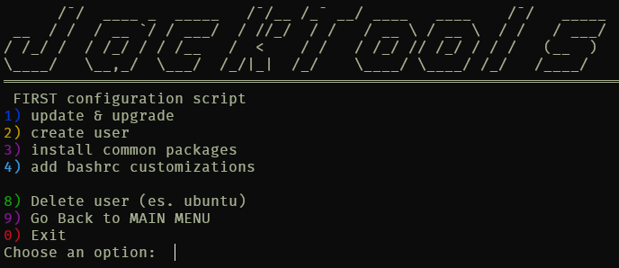
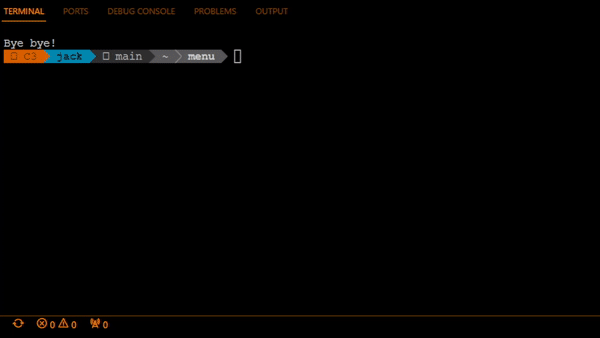

# JackTools

> [!WARNING]  
> `GIT` part is a "one day project idea" just for fun, and it is highly improvable!

The `First configuration` part is for lazy people like me, but can be easly improved based on your needs.

##  Description

JackTools is a simple bash script that helps you to remember some common commands for first boot or start with GIT.

### Usage

Run the script with ```./jacktools.sh```

If you want to customize the configuration, to in the ```configuration``` folder and edit the first variable in```tfirst.sh``` file:

```bash
localfile=1
```
> 1 = local files, 0 = github files

> [!NOTE]
> Temporary files are located in the ```/tmp/jacktools/``` folder.

-----

You can also use the tfirst.sh file as a standalone script.

-----

## Menu sample






###  Features

- Common Commands at first system use
- Common Git Commands
  
-----

###  How I think at it

Usually I use an alias for the script, like:
```alias jt='jacktools.sh'```
but wait, the script cant add the alias for you!

Is a simple script where add your own commands you need to launch on every new system.

-----

